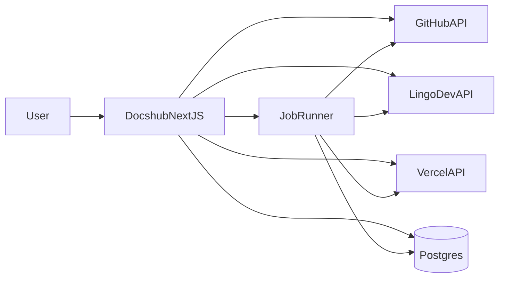
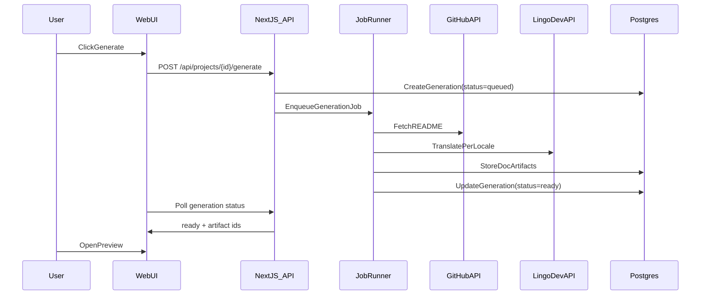

***

name: Docshub README→Docs
overview: Build a Next.js app where users connect GitHub, pick a repo, generate a Nextra docs site from README (multi-language via Lingo.dev), preview it, then optionally push the generated site to GitHub and deploy it to Vercel via user OAuth.
todos:

* id: setup-app-shell
  content: Initialize Next.js app (App Router) with shadcn/ui, Tailwind, base layouts, dashboard scaffolding.
  status: pending
* id: auth-github-nextauth
  content: Add NextAuth GitHub login, persist token securely, protect app routes.
  status: pending
  dependencies:
  * setup-app-shell
* id: github-repo-readme
  content: Implement GitHub repo listing + README fetch endpoints and UI picker.
  status: pending
  dependencies:
  * auth-github-nextauth
* id: generation-pipeline
  content: Implement README→MDX transform + Nextra scaffolding (meta/nav) + artifact persistence.
  status: pending
  dependencies:
  * github-repo-readme
* id: lingo-i18n
  content: Integrate Lingo.dev translation per locale with caching; add locale selection UI.
  status: pending
  dependencies:
  * generation-pipeline
* id: preview-ui
  content: Build in-app MDX preview pages with locale switcher and navigation.
  status: pending
  dependencies:
  * lingo-i18n
* id: export-to-github
  content: Generate a Nextra site from templates and push to GitHub (same repo folder or new repo).
  status: pending
  dependencies:
  * preview-ui
* id: deploy-to-vercel
  content: Implement Vercel user OAuth connect and create/update project + trigger deploy from generated repo.
  status: pending
  dependencies:
  * export-to-github
* id: jobs-observability
  content: Add job runner (e.g., Inngest), retries, status polling, and basic audit/error logs.
  status: pending
  dependencies:
  * generation-pipeline
  * export-to-github
  * deploy-to-vercel

***

# README-to-Documentation Site Generator (Docshub)

## Product scope (MVP)

* **Auth**: GitHub login via NextAuth.
* **Repo connect**: list user/org repos, pick one, fetch README.
* **Generate**: transform README → Nextra site (MDX + nav/meta), plus per-locale variants via Lingo.dev.
* **Preview**: show a live preview inside Docshub (rendered from stored MDX) before exporting.
* **Export**: push generated Nextra site to GitHub (same repo or new repo) and deploy to Vercel using user OAuth.

## Key architecture decisions

* **Two outputs**:
  * **Preview output (in-app)**: render stored MDX using an internal MDX renderer (no full Next build) for fast/cheap preview.
  * **Export output (Nextra template)**: generate a real Nextra project on disk (from a template), then push it to GitHub and let Vercel build it.
* **Async generation**: generation/translation/publish runs as a background job (so UI stays responsive and failures can be retried).

## Data model (minimal)

* **User**: id, email, name, image.
* **GitHubAccount**: userId, githubUserId, accessToken (encrypted), scope, tokenExpiresAt.
* **Project**: id, userId, repoFullName, repoId, defaultBranch, readmePath, status, createdAt.
* **Generation**: id, projectId, sourceSha, locales\[], status, logs, createdAt.
* **DocArtifact**: id, generationId, locale, mdxContent, metaJson, sidebar.
* **PublishTarget**: id, projectId, type(github|vercel), config, lastStatus.

## Main flows

### Auth + repo selection

1. User signs in with GitHub.
2. Dashboard lists repos (via GitHub API using stored token).
3. User selects repo → create `Project`.

### Generate + preview

1. User clicks Generate.

2. Job fetches README (and optionally `docs/` folder if you later expand beyond README).

3. Pipeline:

   * Parse README markdown → normalize headings → convert to MDX.
   * Create Nextra nav (`_meta.json`) + optional `theme.config.tsx` values.
   * For each locale: call Lingo.dev to translate markdown/MDX safely (preserve code fences/links).

4. Store `DocArtifact` per locale.

5. Preview route renders artifact MDX + navigation.

### Export + deploy

1. User clicks Export.

2. Job materializes a Nextra site from `/templates/nextra-docs` + generated files.

3. Push to GitHub:

   * **Option A**: commit to same repo under `/docs-site` (or `/docs`).
   * **Option B**: create a new repo `<repo>-docs` and push there.

4. Deploy to Vercel:

   * Use Vercel OAuth token to create/update a Vercel project from the GitHub repo.
   * Trigger deployment and return preview URL.

## Mermaid diagrams

### System context

### Generation sequence

## MECE task breakdown (with deliverables)

### 1) Repo setup & base app shell

* Next.js (App Router), TypeScript, Tailwind, shadcn/ui, layout, routing groups.
* Env management and config validation.

### 2) Authentication & identity

* NextAuth GitHub provider.
* Persist GitHub access token securely.
* Session + route protection.

### 3) GitHub integration

* Repo listing (user + orgs).
* README fetch (detect `README.md`, `README.mdx`, etc.).
* Push changes (create branch + PR or direct commit; choose PR by default).

### 4) Doc generation pipeline (README → MDX → Nextra structure)

* Markdown normalization (headings, relative links/images → absolute or repo-raw).
* MDX-safe transforms.
* Nextra navigation scaffolding (`_meta.json`).

### 5) i18n generation via Lingo.dev

* Locale selection UI + defaults.
* Translation job: preserve code blocks/frontmatter/links.
* Cache translations by `sourceSha+locale`.

### 6) Preview experience (in-app)

* Project page with generation status.
* MDX renderer with shadcn components.
* Locale switcher to preview each generated locale.

### 7) Export & deployment

* Template-based Nextra site generation.
* GitHub push options (same repo folder vs new repo).
* Vercel OAuth connect + create project + deploy.

### 8) Persistence, jobs, observability

* Prisma schema + migrations.
* Job runner integration (e.g., Inngest) and retries.
* Audit logs, error reporting, rate limiting.

### 9) Security & compliance (MVP level)

* Encrypt tokens at rest.
* Minimal GitHub scopes.
* Webhook signature validation (if used).

## Proposed file structure (Next.js app + templates)

### App routes

* [app/(marketing)/page.tsx](app/\\\(marketing\)/page.tsx) — landing
* [app/(auth)/signin/page.tsx](app/\\\(auth\)/signin/page.tsx)
* [app/(app)/layout.tsx](app/\\\(app\)/layout.tsx) — authenticated shell
* [app/(app)/dashboard/page.tsx](app/\\\(app\)/dashboard/page.tsx) — list projects + connect repo
* [app/(app)/projects/\[projectId\]/page.tsx](app/\(app\)/projects/[projectId]/page.tsx) — generate/export controls
* [app/(app)/projects/\[projectId\]/preview/\[locale\]/page.tsx](app/\(app\)/projects/[projectId]/preview/[locale]/page.tsx) — MDX preview

### API routes (App Router)

* [app/api/auth/\[...nextauth\]/route.ts](app/api/auth/[...nextauth]/route.ts)
* [app/api/github/repos/route.ts](app/api/github/repos/route.ts) — list repos
* [app/api/github/readme/route.ts](app/api/github/readme/route.ts) — fetch README
* [app/api/projects/route.ts](app/api/projects/route.ts) — CRUD
* [app/api/projects/\[projectId\]/generate/route.ts](app/api/projects/[projectId]/generate/route.ts) — enqueue generation
* [app/api/projects/\[projectId\]/export/github/route.ts](app/api/projects/[projectId]/export/github/route.ts)
* [app/api/projects/\[projectId\]/deploy/vercel/route.ts](app/api/projects/[projectId]/deploy/vercel/route.ts)
* [app/api/webhooks/vercel/route.ts](app/api/webhooks/vercel/route.ts) — optional deployment status updates

### Core libraries

* [lib/auth/nextauth.ts](lib/auth/nextauth.ts)
* [lib/auth/session.ts](lib/auth/session.ts)
* [lib/db/prisma.ts](lib/db/prisma.ts)
* [lib/github/client.ts](lib/github/client.ts) — Octokit
* [lib/github/repos.ts](lib/github/repos.ts)
* [lib/github/readme.ts](lib/github/readme.ts)
* [lib/github/push.ts](lib/github/push.ts) — commit/PR
* [lib/lingo/client.ts](lib/lingo/client.ts)
* [lib/lingo/translateMdx.ts](lib/lingo/translateMdx.ts)
* [lib/generator/readmeToMdx.ts](lib/generator/readmeToMdx.ts)
* [lib/generator/nextraScaffold.ts](lib/generator/nextraScaffold.ts)
* [lib/export/materializeTemplate.ts](lib/export/materializeTemplate.ts)
* [lib/vercel/oauth.ts](lib/vercel/oauth.ts)
* [lib/vercel/deploy.ts](lib/vercel/deploy.ts)
* [lib/jobs/queue.ts](lib/jobs/queue.ts) — Inngest/Bull wrapper
* [lib/jobs/generateDocs.ts](lib/jobs/generateDocs.ts)
* [lib/jobs/exportToGithub.ts](lib/jobs/exportToGithub.ts)
* [lib/jobs/deployToVercel.ts](lib/jobs/deployToVercel.ts)

### UI components (shadcn)

* [components/ui/\*](components/ui/) — shadcn primitives
* [components/projects/RepoPicker.tsx](components/projects/RepoPicker.tsx)
* [components/projects/GenerationStatus.tsx](components/projects/GenerationStatus.tsx)
* [components/preview/MdxRenderer.tsx](components/preview/MdxRenderer.tsx)
* [components/preview/LocaleSwitcher.tsx](components/preview/LocaleSwitcher.tsx)

### Templates (exported Nextra site)

* [templates/nextra-docs/](templates/nextra-docs/) — minimal Nextra app
  * `package.json`, `next.config.mjs`, `theme.config.tsx`
  * `pages/index.mdx`, `pages/_meta.json`
  * `public/` assets

### Database

* [prisma/schema.prisma](prisma/schema.prisma)
* [prisma/migrations/](prisma/migrations/)

### Config

* [.env.example](.env.example)
* [lib/config/env.ts](lib/config/env.ts)

## External integrations (credentials)

* **GitHub OAuth** (NextAuth): `GITHUB_ID`, `GITHUB_SECRET`
* **NextAuth**: `NEXTAUTH_SECRET`, `NEXTAUTH_URL`
* **Database**: `DATABASE_URL`
* **Lingo.dev**: `LINGO_API_KEY` (and optional project id)
* **Vercel OAuth**: `VERCEL_CLIENT_ID`, `VERCEL_CLIENT_SECRET`, `VERCEL_REDIRECT_URI`

## Definition of done (MVP)

* User signs in with GitHub, selects repo, generates docs in ≥2 locales, previews, exports to GitHub, and deploys to Vercel with a working URL.
